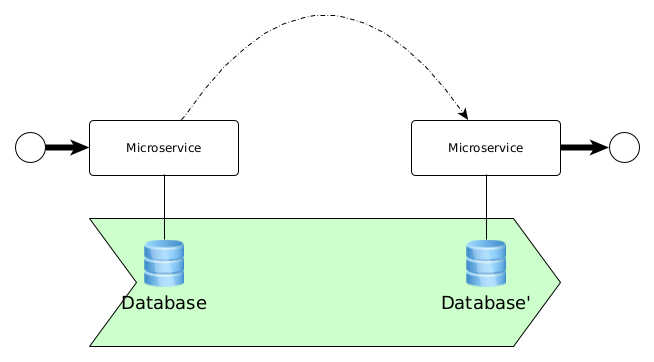
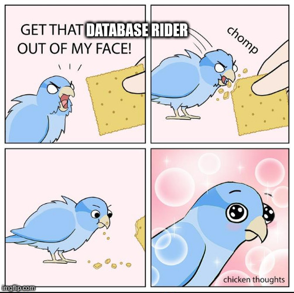

# Testing microservice databases with Database Rider

<!--
Hello and welcome to yet another episode of short and sweet.

Today we're going to talk about testing stateful microservices using Database Rider.

OST: 'cause it's a bitter sweet symphony of testing.
-->

---

# Intro, reason & background


<!--

And now back to the topic.

What are microservices - most probably, you already know it, otherwise you wouldn't be here today.

If not - let's consider them totally autonomous black boxes, ???.

Same applies for the question "why we should test microservices". In a nutshell - to sleep well and not have to worry about any critical bugs.

For sake of simplicity, let's stick to following (very simplified) definition.
-->

---

# Stage/Courtroom

<!--

We define a stateful microservice as a kind of black box.

A black box, which has a state (database), some inputs (ingoing interfaces, e.g. requests, messages) and effects.

Those effects can be (either or both) outgoing interfaces (responses, messages) and changes to the database state.

So basically we can think of the stateful microservice as a state machine and that's exactly, what we want to test - given a database state and certain input, we assert expected database state and certain output.

 -->

 

---

# Objection, your honor!

<!--
Common objections you might hear trying to test the microservice as a black box might include references to the testing pyramid, hexagonal architecture, etc.

You might be told to use proper mocking techniques, etc

In this case you may ask back, how one should otherwise sensibly test complex transactions, JPA listeners, database triggers, etc, and just move along, minding your own business.

Don't let the theory fool you! Don't let anyone prevent you from at least trying it yourself!
-->

---

# Why Database Rider?

<!--
I hope you have tests in your current project or at least you've seen projects having those tests.

You also might have heard of Arquillian Persistence Extension or have seen it in action.

If not, chances are high, that you've seen following code snippets in some form in your project.
-->


```
EntityManager#unwrap(Session.class)
```

```
TestUtil#createTestData(Connection)
```

```
@BeforeEach
void setUp() {
    datasource.getConnection()
    .execute("src/test/resources/some-test.sql");
}
```

---

# Plates shining!

<!--
And now welcome

the protector of your sanity,

the savior of your sleep,

the one, the only

Database Rider! (Knight's Tale, OST: We're the Champions by Queen)

-->

```
@DBRider
```

```
@DataSet(value="dataset.yml", cleanBefore=cleanAfter=true)
```

```
@ExpectedDataSet(value="expected.yml")
```

---

# Dataset yarmor

<!--
Dataset to seed the tests

-->

```
user:
  - id: 1
    name: "@realpestano"
  - id: 2
    name: "@dbunit"
```

---

# More features ~~yet to come~~ ...

<!--
I've been using database rider in projects since 2020 and already had a chance to contribute to it.

One of the features i'd like to work on next is a kind of a SAT solver for expected data set.

Idea behind it to be able to check foreign key references between entities of different tables if ids are generated automatically.

Maintainer of database rider is (in my experience) a very friendly and supportive lad, so -

feel free to give it implementation a try yourself!
-->

- SAT solver for expected data set, see https://github.com/database-rider/database-rider/issues/363

---

# Expect that !

```
USER:
  - ID: $$x$$
    NAME: "@realpestano"
TWEET:
  - ID: abcdef12345
    CONTENT: "dbunit rules!"
    USER_ID: $$x$$
```

---

# Cool fact

<!--
I am a fan of Quarkus and I like to point out cool features/integrations related to it
-->

Database Rider has Quarkus support!*

---

# Links

<!--
In humble hope you might want to dig into the topic deeper afterwards,

here are some helpful links to start with...
-->

- https://github.com/coiouhkc/short-and-sweet-database-rider-intro
- https://github.com/database-rider/database-rider
- https://github.com/database-rider/database-rider/blob/master/rider-examples/quarkus-dbunit-sample/src/test/java/com/github/quarkus/sample/QuarkusDBUnitTest.java
- https://arquillian.org/arquillian-extension-persistence/

---

# Thanks!


---

